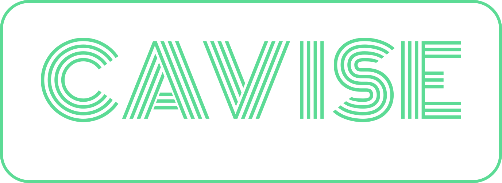

<picture>
  <source media="(prefers-color-scheme: dark)" srcset="./assets/cavise-text-logo-light.svg">
  <source media="(prefers-color-scheme: light)" srcset="./assets/cavise-text-logo-dark.svg">
  
</picture>

 
 

---

CAVISE is the first open-source bidirectional co-simulation environment to combine high-fidelity perception and wireless signal propagation models. It integrates traffic simulation with SUMO, autonomous driving with CARLA and OpenCDA, networking with OMNeT++ and Artery, and propagation modeling with Sionna to support research and development in vehicle-to-everything (V2X) communication, cooperative perception (CoP), cooperative driving automation (CDA), and automotive cybersecurity, with the goal of aiding the emergence of such systems and solutions in the real world.

